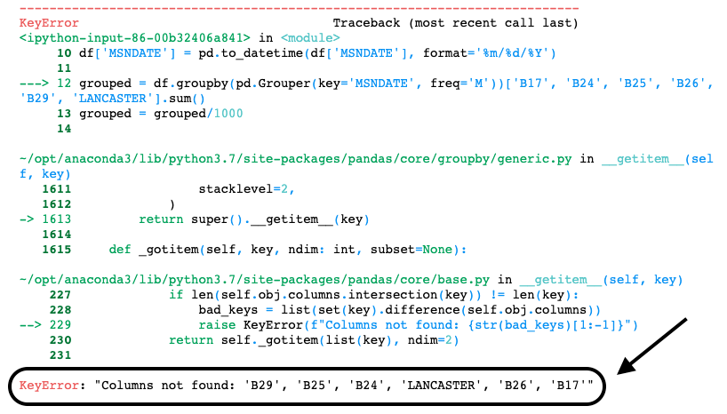

# Notebook Reflection

## Notebook goals
In my notebook, the goal was to choose a different subset of data in the huge THOR CSV file and find ways to visualize and explore. Initially, I was curious to see what other parts of the data could be visualized following Charlie Harper's "Visualizing Data with Bokeh and Pandas" tutorial.[^1] I ultimately learned a lot about the challenges of working with big data files. Even though the dataset I was working with was condensed from 62 columns to 19, I still had 178,281 rows of data that I could explore. With this in mind, it was a learning curve to narrow down exactly what I wanted to look at to create visualizations that someone with limited coding knowledge could easily understand and explore. 

[Here is a link to launch the binder in a live environment, which can be used to run the notebook.](https://mybinder.org/v2/gh/paula-rodrigo/jupyter-notebook/HEAD)

 

## Challenges
### Choosing data
While building my notebook, I initially had a lot more data than what ended up in my final project. At first, I was trying to graph and plot everything I could think of. I had tables for data on aircraft names, target country names, and aircraft and target countries based on different countries. I eventually had to make my notebook more succinct so that it could have a clearer direction and goal, so I chose to focus on information about aircraft because the THOR Draft Data Dictionary cited their data on aircraft information as a particular strength.[^2]

 

Working with the THOR data lead me to think about how much human work goes into recording, formatting, organizing, and eventually communicating data. When I work, I am building on more and more work that people I do not know did before me to make the THOR dataset as easy to work with as it is now.[^3] When Chad Weinard writes in his article, "Data as Medium," that "data is hand-crafted",[^4] this is what he means. I have only scratched the surface of the dataset, and I am building on years of work that has had to take place to get the data from paper records or archives to a digitally readable point.

 

In the context of museums, this brings up issues surrounding data storage. In the article, "Preservation Challenges in the Digital Age," author Bernadette Houghton brings up issues surrounding large volumes of data. How do we decide what gets preserved and stored?[^5] Storing data also means that institutions will need to expand their infrastructure and software to be able to use the data.[^6] With the THOR data, it is available in an open-sourced format online. But, similarly to museum institutions, people at home are limited to their computers and their own knowledge. For museums with open data as well, this poses a barrier for people who are less comfortable with computers. Computer literacy influences who gets to participate and who is left out. In the digital realm, this has implications on what kind of data is preserved, visualized, and valued.

 

### Code wrangling
During the process of creating my notebook, I ran into some issues regarding my code. Most of it I was able to resolve by looking up the error messages and following suggestions on StackOverflow. For the time-series graph, I got an error initially when trying to filter by aircraft name.
 
A screenshot of my initial code:

 
A screenshot of the error:

 
I decided to use a step from Melanie Walsh's Pandas tutorial[^7] to write the specific data that I filtered into its own CSV file to create the graph. This is the code I ended up with at the end: 

Here, again, we can see that even when following tutorials things can go wrong with the code. This would be a roadblock to accessibility for people who are not as experienced with code or computers. It also exemplifies the need for GLAM institutions to hire more qualified personnel, as institutions would have much more data to manage than what I was working with. At the same time, the way that I approached my solution may be different from someone else. This poses another problem that comes with digital data preservation and management. As Houghton points out, even if institutions have qualified staff, the technology changes rapidly, and there are no set standards in the field.[^8]

 

## Interpretations and extending the notebook
After creating my notebook, I can see many ways that the data and the visualizations could be extended. Much of the data that I ended up focusing on changes the interpretations and conclusions that someone would come away with the THOR dataset. I think that one crucial strength that open data has is that it can be a more equitable and democratic approach to interpreting data. When information is open source, authority over the interpretation is shared.[^9] Anyone who is interested and has some knowledge of computers can choose different parts of the dataset to look at. The filtering and value count commands could be used to dig into data that interest different kinds of people. For example, after looking at how the top aircraft were used in bombing missions, I became interested in looking at the top target countries in the dataset.
 

 
I was surprised to see that the Philippine Islands was one of the top target countries, especially because my family is from there and my grandparents were alive during the Second World War. What could the data tell me about their experiences? For others looking at the data, other countries or columns may be of more interest to them. Ultimately, I hope that the notebook inspires new ways to interpret the THOR dataset, as I have barely scratched the surface. 

 

## Conclusion
Overall, I did not have as much trouble with the technical aspects of the notebook as I thought I might. Googling my error messages led me to helpful forums with solutions. Yet, the process of creating the notebook really helped me to situate what I have learned in broader issues surrounding digital work in GLAM institutions. I had never worked with a dataset that was so large before in previous digital history classes. To me, this notebook illustrates so clearly that what you choose to work with and visualize in the data can leave more out than what ends up being communicated. After creating my notebook, I now feel like I can approach the same data set again with new questions and more things to explore. 
***

[^1]: Charlie Harper, "Visualizing Data with Bokeh and Pandas." The Programming Historian. https://programminghistorian.org/en/lessons/visualizing-with-bokeh#the-wwii-thor-dataset.

[^2]: "THOR Draft Data Dictionary," Data.World, accessed April 19, 2021, 
https://data.world/datamil/thor-data-dictionary/workspace/file?filename=THOR+Draft+Data+Dictionary+Dec+2016.pdf

[^3]: Chad Weinard, "Data as Medium." Medium. https://medium.com/@caw_/data-as-medium-361814dba6a9.

[^4]: 
Weinard, "Data as Medium."

[^5]: Bernadette Houghton, "Preservation Challenges in the Digital Age," *D-Lib Magazine 22*, no.7/8 (July/August 2016): http://www.dlib.org/dlib/july16/houghton/07houghton.html. 

[^6]: 
Houghton, "Preservation Challenges in the Digital Age."

[^7]: Melanie Walsh, "Pandas Basics - Part 1," Introduction to Cultural Analytics & Python. https://melaniewalsh.github.io/Intro-Cultural-Analytics/Data-Analysis/Pandas-Basics-Part1.html#write-to-csv. 

[^8]: 
Houghton, "Preservation Challenges in the Digital Age."

[^9]: Annie Anderson et al., "Interpretation: Liberating the Narrative," *MASSAction, Museums as Site for Social Action*, toolkit, https://static1.squarespace.com/static/58fa685dff7c50f78be5f2b2/t/59dcdd27e5dd5b5a1b51d9d8/1507646780650/TOOLKIT_10_2017.pdf.

# References
Anderson, Annie, Ashley Rogers, Emily Potter, Elon Cook, Karleen Gardner, Mike Murawski, Swarupa Anila, and Alussa Machida. "Interpretation: Liberating the Narrative." *MASSAction, Museums as Site for Social Action*. Toolkit. https://static1.squarespace.com/static/58fa685dff7c50f78be5f2b2/t/59dcdd27e5dd5b5a1b51d9d8/1507646780650/TOOLKIT_10_2017.pdf. 
  
Data.World. "THOR Draft Data Dictionary." Accessed April 19, 2021. https://data.world/datamil/thor-data-dictionary/workspace/file?filename=THOR+Draft+Data+Dictionary+Dec+2016.pdf. 
  
Harper, Charlie. "Visualizing Data with Bokeh and Pandas." The Programming Historian. https://programminghistorian.org/en/lessons/visualizing-with-bokeh#the-wwii-thor-dataset.
  
Houghton, Bernadette. "Preservation Challenges in the Digital Age." *D-Lib Magazine* 22 (July/August 2016). http://www.dlib.org/dlib/july16/houghton/07houghton.html. 
  
Walsh, Melanie. "Pandas Basics - Part 1." Introduction to Cultural Analytics & Python. https://melaniewalsh.github.io/Intro-Cultural-Analytics/Data-Analysis/Pandas-Basics-Part1.html#write-to-csv. 
  
Weinard, Chad. "Data as Medium." Medium. https://medium.com/@caw_/data-as-medium-361814dba6a9
